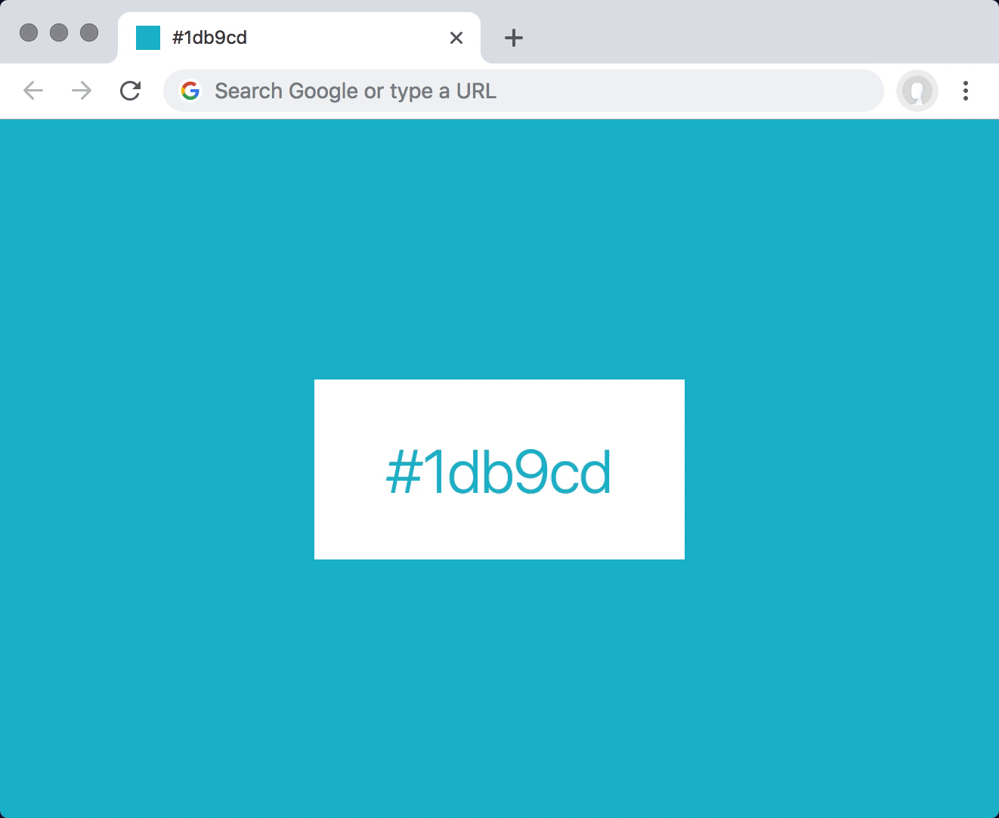

# OnTheGo 🍽️

**OnTheGo** is a full-featured web application designed for traveling salespeople and anyone on the go who needs to quickly find the best restaurants nearby. The app provides an interactive map, detailed restaurant information, and convenient links to reviews, social media, delivery services, and reservation platforms — all in one place.



## ✨ Features

### 🗺️ Interactive Map
- **Apple MapKit JS** satellite map with automatic **Leaflet** fallback layers (Esri satellite, Google roads/hybrid, and OpenStreetMap street tiles)
- Automatic geolocation to center map on your current location
- Restaurant markers with interactive popups
- Click markers to view restaurant details
- Visual distinction between user location and restaurant locations

### 📋 Restaurant Discovery
- Curated, scrollable list of nearby restaurants
- Each restaurant card displays:
  - Restaurant name and cuisine type
  - Star rating and review count (from Yelp)
  - Price level indicator ($, $$, $$$, $$$$)
  - Distance from your location
  - Full address and phone number
  - High-quality thumbnail image

### 🔍 Smart Filtering & Search
- **Search bar** to find restaurants by name or cuisine type
- **Filter by cuisine** - Italian, Japanese, Mexican, Thai, and more
- **Filter by price level** - Budget to Very Expensive
- **Sort options** - By rating, distance, or review count
- Real-time filtering with instant results

### ⭐ Yelp Integration
- Direct **"View on Yelp"** links for each restaurant
- Display Yelp ratings and review counts
- Seamless integration with Yelp Fusion API
- Automatic fallback to sample data when API is not configured

### 📱 Social Media Links
- Quick access to restaurant social media profiles:
  - **Instagram** - View photos and stories
  - **Facebook** - Check their page and posts
  - **Twitter/X** - See latest updates
- Fallback to Google search if direct links unavailable

### 🚗 Delivery Options
- One-click access to popular delivery platforms:
  - **Uber Eats** - Order delivery instantly
  - **DoorDash** - Get food delivered fast
  - **Grubhub** - Browse menus and order
- Smart search integration for each platform

### 🍽️ Make Reservations
- Quick links to reservation platforms:
  - **OpenTable** - Book a table easily
  - **Resy** - Reserve at top restaurants
- Automatic restaurant search on each platform

### 📱 Mobile-First Design
- Fully responsive layout optimized for mobile devices
- Sidebar + map layout on desktop
- Stacked layout on mobile for easy scrolling
- Touch-friendly buttons and interactions
- Clean, modern UI with professional styling

## 🚀 Tech Stack

- **Frontend**: HTML5, CSS3, Vanilla JavaScript
- **Backend**: Node.js + Express (Yelp proxy)
- **Mapping**: [Apple MapKit JS](https://developer.apple.com/maps/mapkitjs/) with [Leaflet.js](https://leafletjs.com/) fallback layers
- **API**: [Yelp Fusion API](https://www.yelp.com/developers) for restaurant data
- **Icons**: [Font Awesome 6](https://fontawesome.com/)
- **Styling**: Custom CSS with CSS Variables for theming
- **Geolocation**: Browser Geolocation API

## 📦 Project Structure

```
onthego/
├── index.html              # Main HTML page
├── api/
│   └── yelp-search.js      # Vercel serverless Yelp proxy
├── css/
│   └── styles.css          # All application styles
├── js/
│   ├── app.js              # Main application logic
│   ├── map.js              # Primary map initialization and fallback layers
│   ├── api.js              # API calls and data utilities
│   ├── ui.js               # UI rendering and interactions
│   ├── config.js           # Configuration and sample data
│   ├── account.js          # Account modal + TripIt connection flows
│   └── worldmap.js         # Travel history world map
├── lib/
│   └── tripit-token-store.js # Persistent TripIt OAuth token store
├── test/                   # Node.js test suite
├── server.js               # Express proxy + TripIt + MapKit endpoints
├── package.json            # Node.js dependencies and scripts
├── package-lock.json       # Dependency lockfile
├── .env.example            # Environment variable template
├── homepage.html           # Marketing / landing page
└── README.md               # This file
```

## 🛠️ Setup Instructions

### Prerequisites
- A modern web browser (Chrome, Firefox, Safari, Edge)
- A web server (optional for local development)
- Node.js 18+ (for the Yelp proxy server)
- Yelp Fusion API key (optional - app works with sample data)

### 1. Clone the Repository
```bash
git clone https://github.com/abell35213/onthego.git
cd onthego
```

### 2. Get a Yelp API Key (Optional)

The app works with sample data out of the box, but for real restaurant data:

1. Go to [Yelp Fusion API](https://www.yelp.com/developers/v3/manage_app)
2. Create a Yelp account or log in
3. Create a new app to get your API key
4. Copy your API key

### 3. Configure Environment Variables

1. Copy `.env.example` to `.env`:
   ```bash
   cp .env.example .env
   ```

2. Open `.env` and add the keys you need:
   ```
   YELP_API_KEY=your_actual_yelp_api_key_here
   OPENAI_API_KEY=your_openai_api_key_here      # optional
   TRIPIT_API_KEY=your_tripit_api_key_here      # optional
   TRIPIT_API_SECRET=your_tripit_api_secret_here # optional
   ```
3. (Optional) Adjust the cache / token settings in `.env` if you want different defaults:
   ```
   YELP_CACHE_TTL_SECONDS=300
   YELP_CACHE_STALE_SECONDS=600
   MAPKIT_TOKEN_TTL_SECONDS=1800
   ```

## ✈️ TripIt Integration

### Required configuration
- `TRIPIT_API_KEY` and `TRIPIT_API_SECRET` are required for the TripIt OAuth 1.0 flow. If either value is missing, `/api/tripit/connect` and `/api/tripit/trips` return a `tripit_not_configured` error.
- Keep these values server-side only. Do not expose them in frontend bundles, client-side config, or public deployment settings.

### Callback URL requirements
- The OAuth callback route for this app is exactly `/api/tripit/callback`.
- The frontend must start the connect flow by passing a fully-qualified callback URL on the same origin as the current app request, for example `http://localhost:3000/api/tripit/callback` in local development or `https://your-app.example.com/api/tripit/callback` in production.
- The server validates that the callback URL origin exactly matches the application origin for the current request. Mixed-origin callbacks are rejected with `400 callback URL must match the application origin`.
- TripIt redirects back to that callback route with `oauth_token` and `state`; the server exchanges the authorized request token for an access token and then stores only the opaque OnTheGo session identifier in the browser cookie.

### Local vs. production origins
- **Local development:** use the same localhost origin for both the app and callback URL, such as `http://localhost:3000` with `http://localhost:3000/api/tripit/callback`. Do not start the flow from one localhost port and send the callback to another.
- **Production:** use the exact deployed HTTPS origin for both the app and callback URL, such as `https://app.example.com` with `https://app.example.com/api/tripit/callback`. Do not proxy the callback through a different subdomain or non-production host.
- If you terminate TLS at a proxy/load balancer, make sure Express still sees the public origin correctly so callback-origin validation stays aligned with the browser-visible URL.

### Security guidance
- Use **OAuth 1.0 only** for production TripIt integrations.
- Do **not** use TripIt web/basic authentication in production. TripIt documents Basic Auth as a testing/development-only option, while this app is implemented around the OAuth 1.0 request-token → authorize → access-token flow.
- Treat TripIt request/access tokens and the local token store as secrets. Store them only on the server and revoke them through `/api/tripit/disconnect` when a user disconnects.

### Runbook: common 401/403 TripIt failures
TripIt's official API docs call out several common authorization failures to check first:

- **401 Unauthorized — inactive consumer:** verify the API consumer behind `TRIPIT_API_KEY` is still active in TripIt. A deactivated consumer key will cause authorization to fail before the user can connect successfully.
- **401 Unauthorized — timestamp skew:** TripIt rejects OAuth requests when the client timestamp is more than ±3 hours from TripIt's current time. Confirm your server clock is synchronized with NTP and that containers/VMs are not drifting.
- **403 Forbidden — unconfirmed TripIt account:** TripIt returns 403 when the TripIt account authorizing the consumer has not been confirmed yet. Have the user finish TripIt account confirmation before retrying.
- **401 Unauthorized — authorization revoked or stale tokens:** if the user removed the app from TripIt's authorized applications, reconnect the account to mint a new access token.

### Manual QA checklist
Use this checklist whenever you change the TripIt account flow:

- [ ] **Connect:** starting from a disconnected state, click Connect TripIt, approve the OAuth prompt, and verify the app reports `connected: true` with the expected account label.
- [ ] **Cancel auth:** start Connect TripIt, cancel or close the TripIt authorization step, and verify the UI returns to a safe disconnected/error state without leaving a broken spinner or stale session.
- [ ] **Reconnect:** connect once, then run the connect flow again and verify the account can be re-authorized cleanly without duplicate/broken UI state.
- [ ] **Disconnect:** while connected, disconnect the TripIt account and verify the cookie-backed session is revoked and subsequent trip fetches require reconnecting.
- [ ] **Sync pagination:** connect an account with enough trips to span multiple TripIt pages, trigger sync, and verify all available pages are merged without duplicates while `sync_metadata` reflects the requested page count and truncation behavior.


### 4. Run the Application

#### Option A: Node + Express (Recommended for Yelp data)
```bash
npm install
npm start
```

Then open `http://localhost:3000` in your browser.

#### Option B: Simple HTTP Server (Python)
```bash
# Python 3
python -m http.server 8000

# Python 2
python -m SimpleHTTPServer 8000
```

Then open `http://localhost:8000` in your browser.

#### Option C: Node.js HTTP Server
```bash
npx http-server -p 8000
```

Then open `http://localhost:8000` in your browser.

#### Option D: VS Code Live Server
1. Install the "Live Server" extension in VS Code
2. Right-click `index.html` and select "Open with Live Server"

#### Option E: Open Directly
For basic testing, you can open `index.html` directly in your browser. Note: Some features may not work due to CORS restrictions.

### 5. Enable Location Services

When prompted by your browser, **allow location access** to see restaurants near you. If you deny access, the app will default to San Francisco, CA.

## 🎮 Usage Guide

### Finding Restaurants
1. **Open the app** - The map will center on your current location
2. **Browse the list** - Scroll through nearby restaurants in the sidebar
3. **Click a marker** - View restaurant details in a popup
4. **Click a card** - Pan the map to that restaurant's location

### Filtering & Searching
- **Search**: Type in the search bar to find restaurants by name or cuisine
- **Filter by cuisine**: Select a cuisine type from the dropdown
- **Filter by price**: Choose a price range
- **Sort**: Change the sort order (rating, distance, reviews)

### Taking Action
- **View on Yelp**: Read reviews and see more photos
- **Order delivery**: Click Uber Eats, DoorDash, or Grubhub
- **Make a reservation**: Use OpenTable or Resy
- **Check social media**: Visit Instagram, Facebook, or Twitter

### Mobile Usage
- **Swipe** to scroll through the restaurant list
- **Tap** a card to see it on the map
- **Tap** action buttons to visit external sites
- **Pinch/zoom** the map as needed

## 🔧 Configuration

### Customizing Default Location
Edit `js/config.js`:
```javascript
const CONFIG = {
    DEFAULT_LAT: 40.7128,  // New York City
    DEFAULT_LNG: -74.0060,
    DEFAULT_ZOOM: 13,
    // ...
};
```

### Adjusting Search Radius
Edit `js/config.js`:
```javascript
const CONFIG = {
    SEARCH_RADIUS: 3000,  // 3km instead of 5km
    SEARCH_LIMIT: 30,     // Show up to 30 restaurants
    // ...
};
```

### Using Custom Mock Data
Edit the `MOCK_RESTAURANTS` array in `js/config.js` to add your own sample restaurants.

## 🎨 Customization

### Color Scheme
The app uses CSS variables for easy theming. Edit `css/styles.css`:
```css
:root {
    --primary-color: #FF6B35;    /* Main brand color */
    --secondary-color: #004E89;  /* Secondary accent */
    --accent-color: #F77F00;     /* Highlight color */
    /* ... */
}
```

### Styling
All styles are in `css/styles.css`. The design is mobile-first with responsive breakpoints at:
- 768px (tablet)
- 1024px (desktop)
- 480px (small mobile)

## 🐛 Troubleshooting

### Location Not Working
- **Check browser permissions**: Ensure location access is allowed
- **Try HTTPS**: Geolocation requires HTTPS in production
- **Fallback**: The app will use San Francisco as default

### No Restaurants Showing
- **Check API key**: Verify your Yelp API key in `.env`
- **Check server**: Ensure the Node/Express proxy is running (`npm start`)
- **Mock data**: The app should show sample data if API fails
- **Console errors**: Check browser console for error messages

### CORS Issues with Yelp API
The Yelp API has CORS restrictions. For production use:
- Run the included Node/Express proxy (`npm start`)
- Use a CORS proxy service
- Or rely on the built-in mock data for demos

### Map Not Loading
- **Check internet**: MapKit and the Leaflet fallback layers require internet for tiles
- **CDN access**: Ensure CDN resources aren't blocked
- **Console errors**: Check for JavaScript errors

## 🚀 Deployment

### Static Hosting (Recommended)
Deploy to any static hosting service:

- **DigitalOcean App Platform**: Use the existing `.do` directory
- **Netlify**: Drag and drop the entire folder
- **Vercel**: Connect your GitHub repo
- **GitHub Pages**: Enable in repo settings
- **AWS S3**: Upload files to an S3 bucket

### Server Deployment
For Yelp API integration without CORS issues:
1. Deploy the included Node/Express proxy (`server.js`)
2. Set `YELP_API_KEY` and `PORT` in your production environment
3. Serve the static assets from the same server or a frontend host pointed at `/api/yelp-search`

## 🗺️ Future Improvements

- [ ] User authentication and saved favorites
- [ ] Custom restaurant lists and collections
- [ ] Directions integration (Google Maps, Apple Maps)
- [ ] Offline support with service workers
- [ ] More filter options (dietary restrictions, hours, etc.)
- [ ] Restaurant comparison feature
- [ ] Share restaurant recommendations
- [ ] Dark mode theme
- [ ] Multi-language support
- [ ] Integration with more delivery services
- [ ] Backend API for better Yelp integration
- [ ] Restaurant photos gallery
- [ ] User reviews and ratings
- [ ] Price range estimation based on menu data

## 📄 License

This project is open source and available under the [MIT License](LICENSE).

## 🤝 Contributing

Contributions, issues, and feature requests are welcome!

1. Fork the repository
2. Create your feature branch (`git checkout -b feature/AmazingFeature`)
3. Commit your changes (`git commit -m 'Add some AmazingFeature'`)
4. Push to the branch (`git push origin feature/AmazingFeature`)
5. Open a Pull Request

## 👨‍💻 Author

**OnTheGo** - Built for traveling professionals who need quick access to great food nearby.

## 🙏 Acknowledgments

- [Leaflet.js](https://leafletjs.com/) for the amazing mapping library
- [Esri World Imagery](https://www.esri.com/) and [OpenStreetMap](https://www.openstreetmap.org/) for Leaflet fallback tiles
- [Yelp Fusion API](https://www.yelp.com/developers) for restaurant data
- [Font Awesome](https://fontawesome.com/) for beautiful icons
- [Unsplash](https://unsplash.com/) for sample restaurant images

---

**Happy Restaurant Hunting! 🍕🍣🍔🌮**
